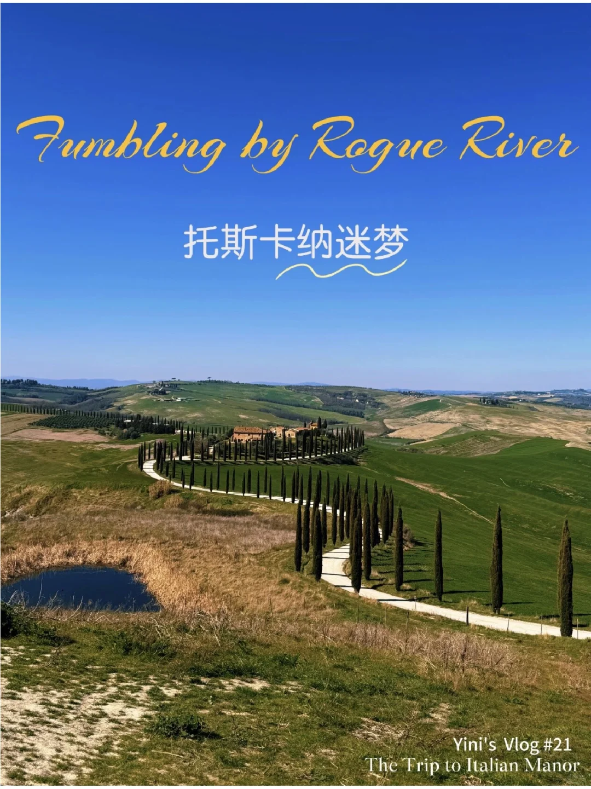

# 坠入一场意大利迷梦💜

时间在这里失重 在碧绿的S弯中穿行，两排丝柏树绵延无尽头 走进托斯卡纳古老的庄园，石缝里沉积着几个世纪的叹息 	 / 	 在石墙与橄榄树的低语间 坠入一场意大利迷梦 “Boundless by the time I cried...” 当暮

**与我的关联：** 个人发展/方法论视角（可由用户手动补充）

**值得深挖吗：** 待定（可由用户手动判断）

> [!tip]- 详情
> ### 原文
> 
> 时间在这里失重
> 在碧绿的S弯中穿行，两排丝柏树绵延无尽头
> 走进托斯卡纳古老的庄园，石缝里沉积着几个世纪的叹息
> 	
> /
> 	
> 在石墙与橄榄树的低语间
> 坠入一场意大利迷梦
> “Boundless by the time I cried...”
> 当暮色染红天际线，
> 钟楼投下长长的影子
> 	
> 你听见了吗？
> 风穿过空寂的庭院
> 正拾起散落的音节
> 拼凑一首未完成的诗
> 	
> 这不是告别，是沉入
> 沉入灿烈的阳光下
> 那永不褪色的托斯卡纳迷梦
> 	
> 
> 
> ### 图片
> 
> 
> 
> ### 视频转录
> 
> （未提取到转录内容）

> [!info]- 笔记属性
> **来源**: 小红书 · Yini小姐
**帖子ID**: 686e1d5a0000000010013ebe
**链接**: https://www.xiaohongshu.com/explore/686e1d5a0000000010013ebe?xsec_token=ABAyoWifi_N3C-ZrxW23Q-5bGJ6jMTe5qvoRoprNVXijM=&xsec_source=pc_user
**日期**: 2025-07-09
**类型**: video
**互动**: 15赞 / 6收藏 / 3评论
**标签**: 托斯卡纳, 意大利