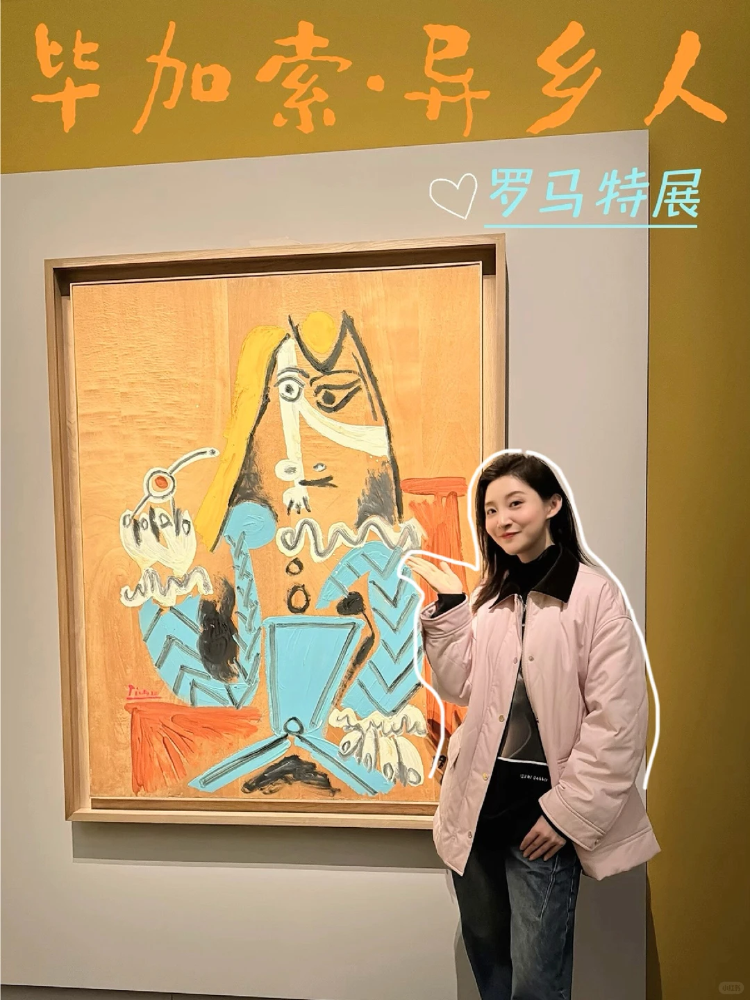

# 🎨“异乡人”毕加索在罗马找到共

毕加索特《LOSTRANIERO》（“异乡人”），像一场关于身份疏离与艺术表达的深度对话。 	 展览聚焦毕加索作为“异乡者/局外人”的视角， 精选的作品能感受到他身处不同文化环境（尤其早期在巴黎等地的经历）下的那种敏锐观察、孤独感，以及由此

**与我的关联：** 个人发展/方法论视角（可由用户手动补充）

**值得深挖吗：** 待定（可由用户手动判断）

> [!tip]- 详情
> ### 原文
> 
> 毕加索特《LOSTRANIERO》（“异乡人”），像一场关于身份疏离与艺术表达的深度对话。
> 	
> 展览聚焦毕加索作为“异乡者/局外人”的视角，
> 精选的作品能感受到他身处不同文化环境（尤其早期在巴黎等地的经历）下的那种敏锐观察、孤独感，以及由此迸发的惊人创造力。
> 	
> 走在展厅里，看着那些变形的人像、充满张力的构图，
> 不禁思考：在快速变化的时代里，我们是否也常感到自己是某种意义上的“异乡人”？
> 	
> 艺术或许正是连接彼此、表达这种复杂情感的桥梁。
> 	
> 视频记录了让我驻足良久的片段和一些布展细节，
> 分享给同样对艺术有深度探索欲的你。
> 	
> 此刻，我们都是毕加索画布上的一缕光。🕊️
> 	
> 
> 
> ### 图片
> 
> 
> 
> ### 视频转录
> 
> （未提取到转录内容）

> [!info]- 笔记属性
> **来源**: 小红书 · Yini小姐
**帖子ID**: 6875d2ae000000001202c92d
**链接**: https://www.xiaohongshu.com/explore/6875d2ae000000001202c92d?xsec_token=ABDRoTMbbIPXleW9qdcPLC1BAJUGnDbMYAdHM2JiZO2BY=&xsec_source=pc_user
**日期**: 2025-07-15
**类型**: video
**互动**: 27赞 / 4收藏 / 4评论
**标签**: 毕加索, 艺术展, 艺术疗愈, 文化